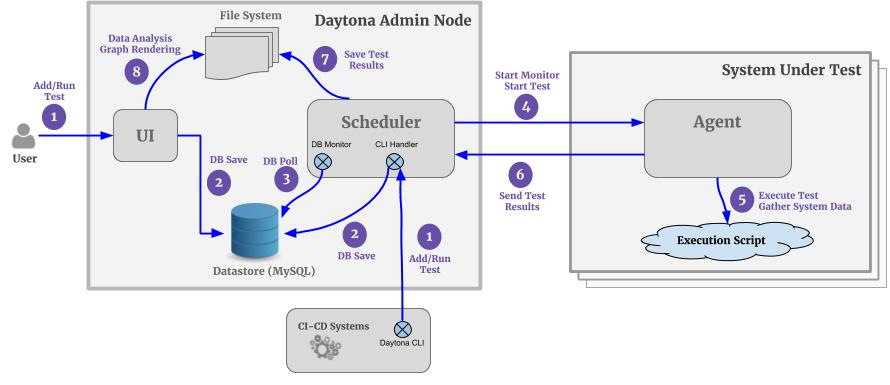
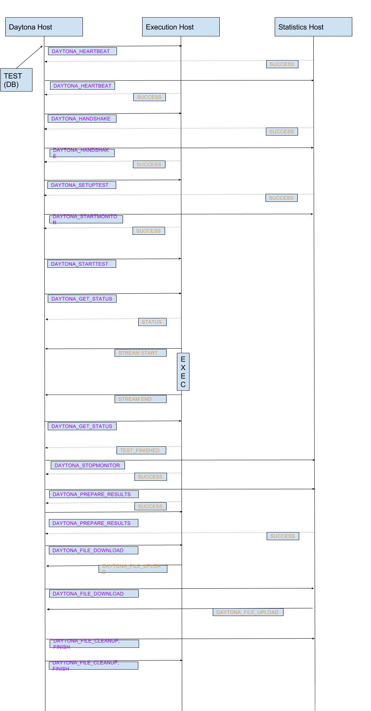

## System Overview

### Introduction
Daytona is a framework that can be used to evaluate the performance of your application in a repeatable and reliable manner. A daytona framework can be created rapidly for an application by answering a simple set of questions. Value-added services that are provided as part of this infrastructure include the following:
* Scheduling performance tests
* Execution of tests
* Hardware resource management
* Presentation of performance results
* Graphing capabilities
* Profiling services
* Trend analysis
* Storage of performance results
* Ability to compare and search test results

It is designed to be hosted as a service in a private or public cloud environment.

### Main features
* Minimal overhead performance analysis platform
* Flexibility to define several different frameworks
* Visual comparison and reporting
* Systematic organization of test results
* Designed for being deployed as a hosted service:
  * Multi-tenant
  * Authentication
  * Authorization
  * Optional profiler integration
* REST API for test results

### Terminology
* Daytona - The web-based, mobile-friendly performance-testing platform.
* Framework - The encompassing workspace for any given product you wish to test. The framework defines the default parameters, execution script location, and other options that every test under the framework will use.
* Test - An instance of a performance test run. A unique number identifies each test. This is the number you would enter in the upper left-hand box to jump to a test.
* Execution Script - The script that drives the performance testing. This script is responsible for any setting up of test environment, execution of tests, and gathering data into formats supported by Daytona.
* Execution Host - The machine that the execution script will run on. A python agent runs on this machine to communicate with the scheduler running on the Daytona host
* Statistics Host(s) - These are machines on which you want Daytona to automatically collect sar (CPU, Memory, Disk I/O, Network usage etc.,) information from. Daytona will present the information in d3.js graph format.
* Daytona Host: The machine running Daytona instance (Apache, Python Scheduler, MySQL, PHP and d3.js graphing components)
* Profiling Host(s): These are the machines on which profilers (Perf, strace) will be run for a set of pids provided by the execution script (Work In Progress)

### Process Overview
Starting from scratch, these are the general steps for creating and running a performance test
* Create a framework in Daytona for your application
* Design and create your execution script(s).
* Create and run a test within the framework you've created
* View and analyze your test results after the test completes
* Compare results from multiple tests within the same performance framework using tabular or graphical format

## Architecture




### Scheduler, Database and Agent Interaction
Any user-driven actions like create framework, create test, execute test, edit tests etc., are inserted into the Daytona database (MySQL). The python scheduler running on the Daytona host polls the database for a scheduled test. Once it finds a test, it sends all the necessary information for running that test to an agent running on the execution host defined for the test. Agent parses all the information and runs the execution script with the arguments passed from the scheduler. Once the test completes, the agent packages all the application and system metrics and sends them to the scheduler. Scheduler saves all the results in the file system and updates appropriate database fields to reflect the status of the test. An email notification with status and brief summary of the test results is sent to the test owner.  Details of this interaction will be elaborated in Daytona Scheduler & Agent section.

### Scheduler & Agent 

An instance of Daytona is a collection of a daytona-server and several other systems that are being analyzed. Examples of such systems that could be analyzed vary from being a web server to a database instance or could even be a proxy router or a filer. A test specification executes specific actions on the hosts, there by uncovering the underlying performance characteristics.
Daytona backend is comprised of mainly two components: scheduler and agent. Agent is a process that communicates with the scheduler on any given target system and executes actions specific to the command. Users of Daytona add test specifications and execute instances of tests using the front end UI. The specifications and request to schedule test instances are persisted into the database. Scheduler picks up the requests and communicates with the Agent to process the requests. A set of actions that are required to be executed on the target system are provided in the form of scripts. Daytona server maintains the end-to-end execution of the recipe. Several different systems could be analyzed in parallel and Daytona maintains different states for each target system.

Communication between the scheduler and agent happens over TCP using a custom protocol. Commands are encapsulated in a custom structure containing the context identification and the test specification. All required parameters for the execution of the command at the target are encapsulated and supplied along with the command. Agents are registered to specific Daytona hosts and commands from unregistered host are ignored.


Communication starts with a handshake step. Test specification is read from the database and the target system intended for analysis is identified. Network reachability of the target system is checked; further the handshake step is invoked. During the handshake, registrations on both sides are performed. In future, security related features could be added here.

Commands are typically dispatched out of order and asynchronously to target systems. Both synchronous and asynchronous command execution are supported. Asynchronous execution is supported via call back mechanism, where the client component upon receiving a command spawns a new execution thread and after completion sends a callback to the port specified in the original command.
Daytona protocol is supported by maintaining a map of command and associated actions, upon receiving a command, relevant command is executed. Finally, in order to support parallel execution of different communication contexts and persist data, a local database is used.

Periodically, the health of all agents in context and the scheduler is checked via a heartbeat command. The exception handling routines are triggered if a heartbeat fails. Each test specification would define the timeout threshold parameter that is used to abort execution of a test that executes beyond the threshold. Scheduler keeps track of all actions in flight and maintains a map of execution times. Each logical stage of execution is persisted into the database.

**Daytona commands**
These commands are used to communicate among the daytona server, agent and statistics hosts.

DAYTONA_HEARTBEAT
Any instance of daytona server or agent is expected to respond to this command with a success in response.
This is to identify if the daytona host is reachable.

DAYTONA_HANDSHAKE
Issued by the scheduler to agents running on target hosts, this would establish a session and the target system now will receive commands only from the registered server.

DAYTONA_LOG
A utility command to send logs statements across.

DAYTONA_SETUP_TEST
Prepares the environment with either setup or create directories. This step will ensure all requirements by the subsequent command to execute a test would be satisfied.

DAYTONA_START_MONITOR
Just before the test is executed, a set of monitors are started to collect statistics for all system resources throughout the test execution.

DAYTONA_START_TEST
This is the trigger to initiate the test asynchronously.

DAYTONA_GET_STATUS
Returns the status of the agent, status pertains to the current test that is being executed.
Different statuses returned by the agent are:
   TestSetup: The host is in setup mode
   Abort: A recent test has been aborted
   TestEnd: Currently running execution script has ended
   Started: Execution of script has started
   TestRunning: Test specified in the execution script is running
   Failed: The execution script or one of the daytona command has failed
   TestFinished: Execution of the script is complete and the results have been archived


**Daytona states**
The database is updated with these states as per the status returned by the agent:
New, Scheduled, Waiting, Running, Completed, Aborted, Failed, FinishedClean, Collating


DAYTONA_STREAM_START
The agent usually sends this command to Daytona server. Once the execution a test starts, the STDOUT and STDERR of the test pid is streamed in real time to the server. Server persists the stream in a test specific logfile. Users could keep track of whatever is printed from with the execution script.

DAYTONA_STREAM_END
Used to indicate the end of test specific STDOUT and STDERR streams.

DAYTONA_STOP_MONITOR
All monitors started before the test starts are stopped using this command. Specific to the test command to stop monitor is sent to all statistics hosts and execution hosts.

DAYTONA_END_TEST
This command is sent from the scheduler to agent, this indicates that the current test is in flight (currently being executed) has to be aborted.

DAYTONA_PREPARE_RESULTS
Upon receiving this command, the agent on execution host prepares an archive of all execution related output files.

DAYTONA_FILE_DOWNLOAD, DAYTONA_FILE_UPLOAD
This command is sent from the scheduler to download results and system metrics files. The DOWNLOAD command actually instructs the agent to upload the required files to the daytona server.

DAYTONA_CLEANUP_TEST
After a test completes successfully or aborted eventual to a failure, this command will cleanup all temporary files.

DAYTONA_FINISH_TEST
After a test is successfully completed and all relevant data is archived, this command indicates the agent to free up all resources held and set internal state of the agent.

DAYTONA_STOP_SERVER
This instructs the server component in scheduler or agent to shut down operations gracefully.

**DB monitor**
This component monitors the database for modifications and additions. A test entry is made by the UI into the DB with initial state as "Scheduled"; the DB monitor periodically checks for such tests and prepares the test specification. Test specifications are at this stage ready for dispatch, handled by a different execution thread. DB monitor also checks for deletion of tests and clears respective results files from the file system. In order to support graceful exit and restart, upon a restart any test that is not in "New", "Scheduled", "Aborted", "Failed" or "Finished" state is resubmitted for execution.

**Test dispatcher**
Test dispatcher picks up the test specifications from DB monitor. DB monitor maintains all specifications that are eligible to be dispatched across different frameworks. Dispatcher component picks one specification per framework and performs the actual steps of orchestration with the target system to start the execution. Agent component on the target supports dispatcher by performing the desired steps. Execution of a test is asynchronous; the dispatcher sends the DAYTONA_START_TEST to the agent and does not wait for the completion. A list of all such test specifications that are in flight (started tests) is maintained by the Dispatcher. Agent streams the console log to the server; users can keep track of the actual test execution using this.

**Execution monitor**
The Execution monitor monitors tests on target systems that are in progress. Execution monitor shares the list of test specification with the Dispatcher. All tests Dispatched are monitored here. Successful completion of tests, failures and timeouts are monitored by this component. Any test that successfully completes execution is listed for the next step of results collation and cleanup. Executions that breach the timeout threshold are aborted. Database is updated with the state by dispatcher.

**Results processor**
The execution monitor invokes this component. All test specifications that are successfully completed are supplied. Relevant results files and logs are collated from all target hosts. Specific posts processing of results are performed. Finally the DB is updated with "Finished" state.

**Client-server based protocol**
Under the hood, the client-server model of both Agent and the Server are actually identical. The same component is invoked in different roles, where one would be a scheduler and the other as agent. Communication between the Daytona Server and the Daytona Agent is fully duplex.


**Agent**

A TCP server handles incoming requests; it honors connection from Scheduler and executes actions for each command as specified in the action map.
Action map is an extensible interface that maps daytona command to an action. Action component maintains the state of the agent and serves the queries for GETSTATUS. Execution of the test recipe is handled by the Action component upon receiving STARTTEST command. Additionally, there is a corresponding handler to each DAYTONA_COMMAND implemented in the Action component.

**Daytona sequence of execution**


### Security Considerations

While Daytona is meant to be an internal performance analysis tool running behind the firewall, it's important to understand the security implications. At present, we do not support TLS between the scheduler and the agent processes. Hence, it's strongly recommended to run both these components within the same datacenter. TLS support is work in progress. The agent or the scheduler process does not entertain arbitrary actions or commands that may be originating from any unintended or malicious intervention. The agent and the scheduler only execute a set of actions/commands specified by Daytona communication protocol.

**Execution Script**
As a security measure, it's strongly recommended that the execution script is not required to be run as root. Just like any piece of software, any command or action run from the execution script need to go through an internal security audit before it's deployed in any production environment. Daytona agent executes this script with arguments passed from the UI. Hence, execution script must adhere to the security protocol of the enterprise.

**MySQL Root Password**
The MySQL root password must be changed after the initial installation.

**Privacy of the Performance Test Results**
We have no mechanism in place to keep the test results private to the creator of the test. We believe it's important to share performance test results with a broader audience within the enterprise to foster collaboration and transparency. Any Daytona user can view results of any test in any framework. They can clone any test and run it. However they are not allowed to edit, delete or re-run a test created/owned by somebody else. 

**Deployment in Public Cloud** When deployed in any public cloud, strict measures must be taken to secure and harden these machines (with appropriate security groups or any other mechanisms provided by the public cloud vendor). This is no different than securing/hardening your environment in any public cloud.

### Directory Structure (Scheduler)
The primary directory on the Daytona host is the location where daytona_root is pointing. Let's look at the following example:

ls -l /var/www/html/daytona/test_data/DaytonaSampleFramework/1001/results/10.91.35.168/
```
drwxrwxrwx 2 48 48    26 May 18 18:12 application
-rwxrwxrwx 1 48 48  2928 May 18 18:12 cpuinfo.txt
-rwxrwxrwx 1 48 48  1226 May 18 18:12 meminfo.txt
-rwxrwxrwx 1 48 48    74 May 18 18:12 multicol.csv
-rwxrwxrwx 1 48 48   111 May 18 18:12 results.csv
drwxrwxrwx 2 48 48  4096 May 18 18:12 sar
```

* test_data is pointing to /var/www/html/daytona/daytona_root/test_data_DH
* test_data: Directory holding test results for all frameworks
* DaytonaSampleFramework: Name of one of the test frameworks
* 10.91.35.168: IP Address of the execution host
* *.csv, *.txt and *.plt are test result files
* application: Directory holding Daytona and application log files
* sar: Directory holding .plt fils for system metrics
  * there will be a sar directory for each Statistics host, in this case we use Execution host also as a Statstics host

### Directory Structure (Agent)

The directory structure for the agent looks very similar to the one for the scheduler

ls -l /tmp/daytona_root/test_data_AGENT/DaytonaSampleFramework/1001/results/10.91.35.168/

```
-rw-r--r-- 1 root root 23394 May 18 18:36 cpuinfo.txt
-rw-r--r-- 1 root root  1226 May 18 18:36 meminfo.txt
-rw-r--r-- 1 root root    74 May 18 18:36 multicol.csv
-rw-r--r-- 1 root root   111 May 18 18:36 results.csv
drwxr-xr-x 2 root root  4096 May 18 18:35 sar
