# Daytona UI

## Login (Authentication)
Sign into Daytona with an existing valid username and password combination.

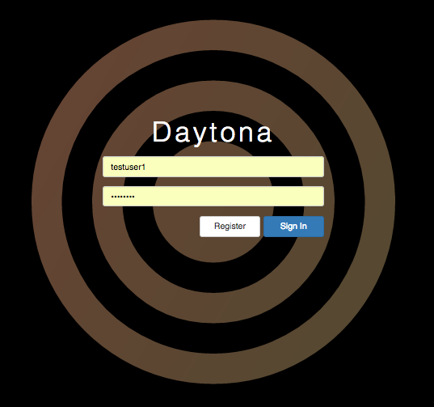

To register a new username, use the **Register** button on the login page and follow the registration form with information about the new user account. An administrator approval may be required before a newly created user can access Daytona.

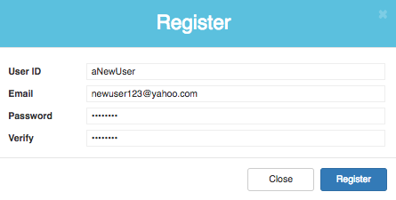

## Home (Global Queue)
Upon logging in with a valid account, a home page with the following is displayed:
* Currently Running: Tests that are in the process of running a performance test
* Waiting Queue: Tests that are scheduled to run. Tests in the waiting queue are typically those that are blocked due to another test using the same hosts that is currently running.
* Last 15 Completed: Recently completed tests
The home page is a global queue of all active framework tests.

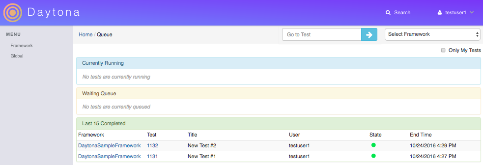

## Framework
### Create
To create a new framework, select **Framework > Create** from the left menu. Fill out all required fields and select **Save** when completed.

### Edit
Frameworks may be edited by selecting **Framework > Edit** when a framework is in focus. To focus on a specific framework, select the framework from the dropdown menu on the top-right or select the framework's link on any relevant pages. 

### Clone
To begin the process of creating a new framework with the same fields as an existing framework, select the **Clone** option from a focused framework.

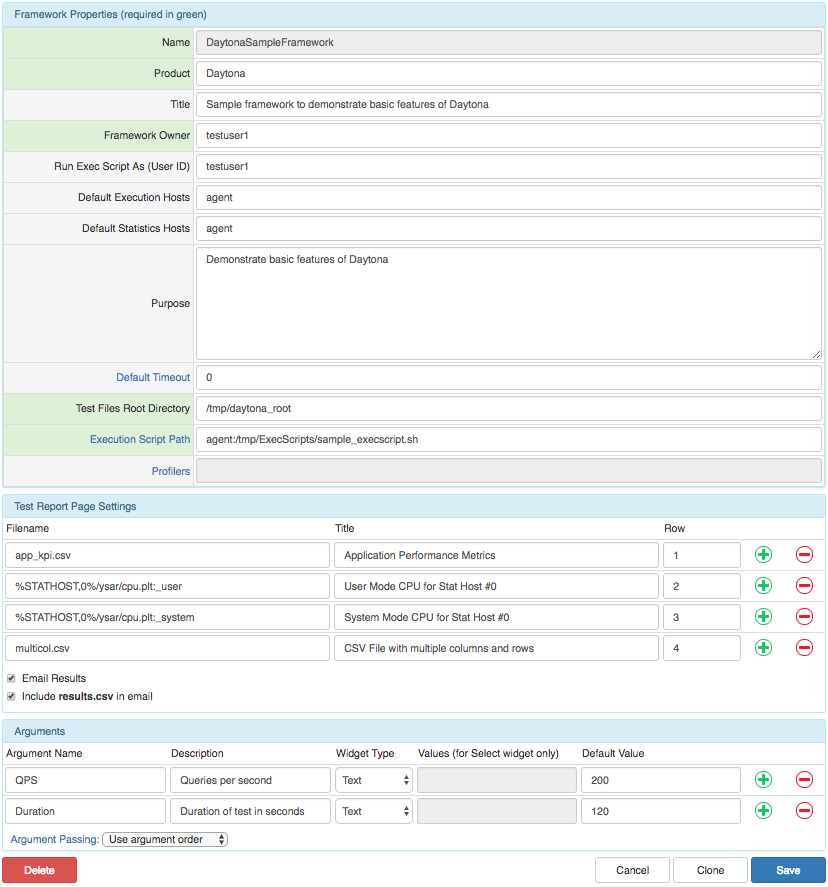

### Active Frameworks
Active frameworks are ones that are available to the user. Tests from active frameworks will be available for viewing/comparing. To modify which frameworks are active, use the frameworks settings page by selecting **Global > Admin**

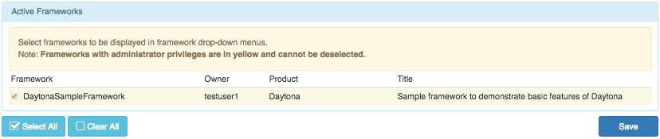

## Test
### Create
To create a new test, first select a framework for the test that will be created. Select **Test > Create** and fill out all required fields and select **Save** when completed. Similar to frameworks, tests may be created using the **Clone** option and may be edited before running again. *Note: Running existing tests will overwrite previous data*

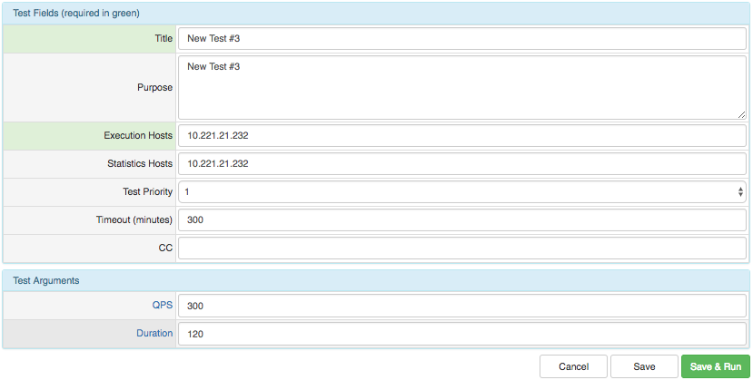

### Information
Information about a test can be found by selecting the test from either the queue, search or jump.

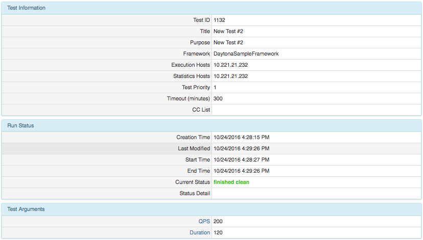

### Test Report
The test report page is a compilation of metrics and information about the test. It will include all files that were specified in the framework configurations. Graphs, tables and information about the test results can be placed in the test report.

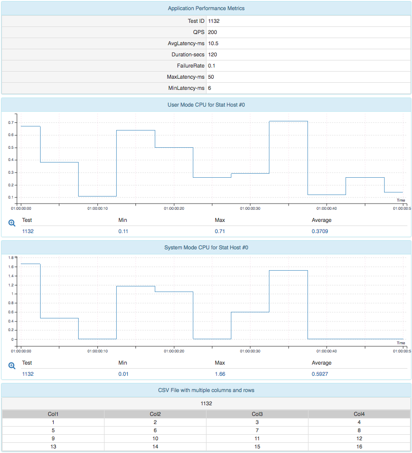

### Test Results/Output
An individual output file can be observed and inspected by selecting the specific result file from the **Output Files** for the selected test.

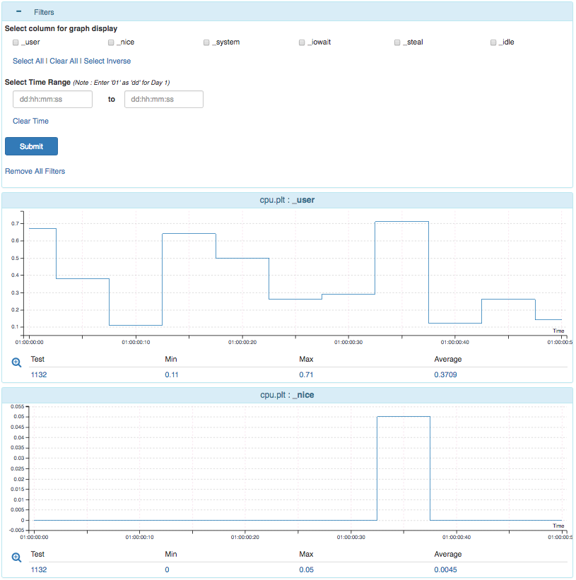

### Test Logs
Logs generated during the test execution may be stored and viewed from the **Logs** menu from a selected test.

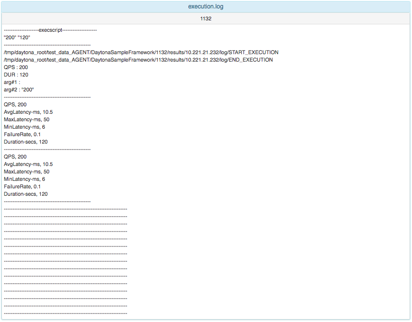

### Compare
Tests from the same framework may be compared against each other. The following pages may be compared:
* Test Information
* Test Report
* Test Output
* Test Log

In order to compare a test, input the test(s) [Comma separated] into the top-left compare field in an applicable page. Compare may also be initiated from the search page.

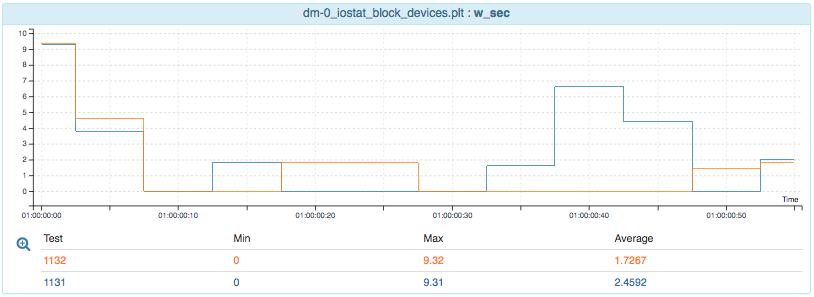

### Search
Select **Search** from the top-right in order to search for specific tests based on various filters. Search results may be used to directly go to a test or to compare/delete batch tests using the checkboxes next to the tests.

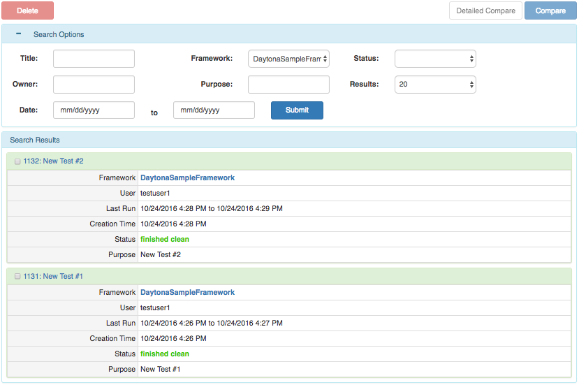
